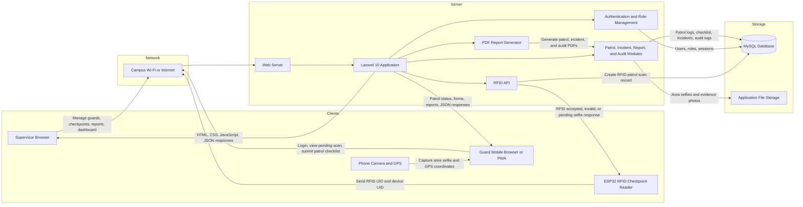

# Client-Server Architecture

## System Overview

The SLSU Bontoc RFID Patrol Monitoring System follows a client-server architecture. The clients are the supervisor web browser, the guard mobile browser or PWA, and the ESP32 RFID checkpoint readers. These clients communicate with the Laravel server through web pages and HTTP API requests. The server processes authentication, patrol records, RFID scans, area selfie submissions, GPS details, incident reports, audit logs, dashboards, and PDF reports. The system stores structured records in MySQL and stores uploaded patrol proof images in application storage.

## Architecture Diagram

## Main Components

| Component | Description |
| --- | --- |
| Supervisor browser | Used by supervisors to manage guards, checkpoints, RFID readers, patrol logs, incident reports, audit logs, and PDF reports. |
| Guard mobile browser or PWA | Used by guards to continue the patrol process after a valid RFID scan, capture the required area selfie, submit GPS details, answer checklist items, and file incident reports when needed. |
| ESP32 RFID checkpoint reader | Reads the RFID card using the MFRC522 module and sends the card UID and reader device UID to the Laravel API over Wi-Fi. |
| Laravel server | Handles the business logic, authentication, user roles, RFID scan validation, patrol workflow, report generation, and database communication. |
| MySQL database | Stores users, guards, checkpoints, RFID scan records, patrol logs, incident reports, audit logs, and report data. |
| Application file storage | Stores uploaded area selfies, checklist proof photos, and incident evidence images. |
| GitHub | Used for source code version control and project collaboration during development. |

## Data Flow

1. The supervisor registers guards, checkpoints, and RFID reader device IDs in the web system.
2. The guard scans an RFID card at a checkpoint using the ESP32 RFID reader.
3. The ESP32 sends the RFID UID and device UID to the Laravel RFID API.
4. The Laravel server validates the RFID card, guard account, checkpoint, reader device, and patrol schedule.
5. If the scan is valid, the system creates a pending patrol record that requires an area selfie.
6. The guard opens the patrol page using a mobile browser or PWA.
7. The guard captures an area selfie, and the browser collects GPS latitude, longitude, accuracy, and timestamp.
8. The Laravel server saves the patrol proof, checklist responses, optional incident report, and audit log.
9. Supervisors view the dashboard, patrol logs, scan issues, incident records, and generated PDF reports.

## Technologies Represented

- PHP and Laravel 10 for the server application
- MySQL for database storage
- Blade, JavaScript, Alpine.js, Tailwind CSS, Vite, Axios, and Chart.js for the web interface
- ESP32, MFRC522 RFID reader, Arduino/C++ firmware, I2C LCD, and buzzer for checkpoint scanning
- Browser camera and geolocation features for area selfie and GPS tagging
- Laravel DomPDF for PDF report generation
- GitHub for version control
